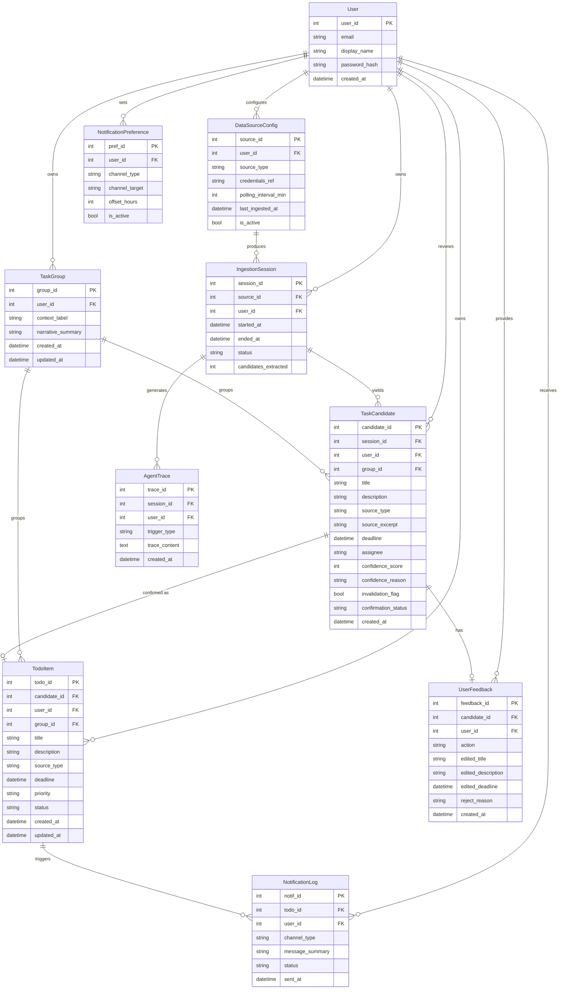
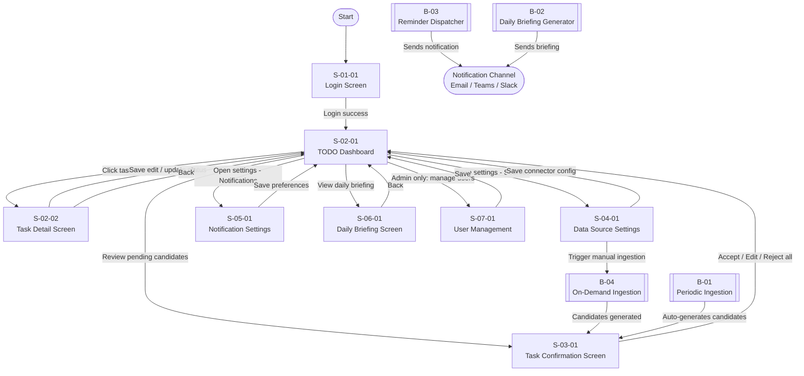

# System Requirement Definition Document
## Task Mom 24/7 — AI-Powered Multi-Source TODO Aggregator

| Item | Detail |
|---|---|
| **Document Version** | 1.0 |
| **Date** | 2026-05-21 |
| **Author** | Team (AI Hackathon) |
| **Status** | Draft |
| **Based On** | hackathon_TofoHunter Agent_requirement_VN_official.md |

---

## 1. System Name

**Task Mom 24/7**
*"Gom TODO từ mọi dự án, nhắc deadline — không quên, không giận, không hối."*

---

## 2. System Objectives

Task Mom 24/7 is an AI Agent system that automatically aggregates work items (TODOs) from multiple sources (Jira, Email, Meeting Minutes, Chat platforms), extracts actionable tasks using an LLM, and proactively reminds users of upcoming deadlines.

**Core value proposition:**
- Eliminate manual task entry — the agent reads and understands work sources autonomously.
- Provide a single unified view of all tasks across all projects and roles.
- Enforce human control through a mandatory Accept / Edit / Reject confirmation flow before any task is officially recorded.
- Demonstrate true AI Agent behavior: multi-step reasoning, tool use, and persistent memory — not just an LLM wrapper.

**Target users:** Members of a software delivery unit who simultaneously participate in multiple projects (Developer, BA, QA, Delivery Manager, AI Engineer, etc.).

---

## 3. User Roles

| Role Code | Role Name | Description |
|---|---|---|
| R-01 | Authenticated User | Any unit member (Dev, BA, QA, DM, AI Engineer) who uses the system to manage their personal TODO list. Interacts with the dashboard, confirms tasks, and configures settings. |
| R-02 | AI Agent (System Actor) | The autonomous agent component that ingests data from external sources, extracts TODO candidates, scores them, groups them into threads, sends reminders, and learns from user feedback. Acts on behalf of R-01 with defined tool calls. |
| R-03 | System Administrator *(Extended Mode only)* | Manages user accounts, source connector configurations, and system-level settings in a multi-user environment. |

---

## 4. Feature List

| Feature Code | Description | Input | Output | Actor | Constraint / Condition |
|---|---|---|---|---|---|
| FR-01 | User Authentication — login with username/password or SSO | Credentials | Session token, redirect to Dashboard | R-01 | Must authenticate before accessing any feature |
| FR-02 | Connect Data Source — configure at least 2 external sources (Jira, Email, Meeting Minutes, Teams/Slack) | Source type, credentials/API key, polling interval | Saved connector config | R-01 | Credentials stored in .env / secret manager; never hardcoded |
| FR-03 | Scheduled / Manual Ingestion — agent fetches raw content from all configured sources | Connector configs, `since` timestamp | Raw content batch per source | R-02 (Agent) | Minimum 2 sources (Sprint Mode); minimum 3 real sources (Extended Mode) |
| FR-04 | TODO Extraction — LLM parses unstructured text and identifies task candidates with structured output | Raw content (email body, transcript, chat log) | List of TaskCandidate objects: `{title, description, source, deadline?, assignee?, confidence_score, confidence_reason}` | R-02 (Agent) | Output must be structured; LLM call is wrapped as a named tool (`extract_todos_from_text`) |
| FR-05 | Confidence Meter — each TaskCandidate is scored 0–100 with a one-line explanation | TaskCandidate | `confidence_score` (0–100), `confidence_reason` (string) | R-02 (Agent) | Signals include: "please deliver", "action item", "need by", imperative verbs, named deadline |
| FR-06 | Thread Intelligence — group TaskCandidates by shared context (client / project / issue) and generate a narrative summary of the task thread | List of TaskCandidates | TaskGroup: `{context_label, narrative_summary, tasks[], invalidation_flag}` | R-02 (Agent) | Tasks that may be invalidated by requirement changes must be flagged for user confirmation before retention |
| FR-07 | Task Confirmation Queue — user reviews each TaskCandidate (or batch) and performs Accept / Edit / Reject | TaskCandidate list, user action | Confirmed TodoItem stored in DB, or discarded | R-01 | No task is auto-added without explicit user confirmation; batch confirmation supported |
| FR-08 | Centralized TODO Dashboard — display all confirmed tasks sorted by priority / deadline | Confirmed TodoItem list | Paginated, sortable/filterable list view | R-01 | Visible fields: title, source, deadline, priority, status, thread group |
| FR-09 | Task Detail View — view full detail of a single task including thread context and source excerpt | TodoItem ID | Detail screen with all fields + thread narrative + source snippet | R-01 | Source excerpt displayed read-only |
| FR-10 | Task Edit & Status Update — user manually edits task fields or updates status (Todo / In Progress / Done) | Updated field values | Persisted TodoItem | R-01 | Edits are tracked in audit log |
| FR-11 | Deadline Reminder — agent sends reminder notifications before deadline via user-chosen channel | TodoItem with deadline, user notification preferences | Notification dispatched (in-app / email / Teams / Slack) | R-02 (Agent) | Default: 1 day before, 1 hour before; configurable per user |
| FR-12 | Notification Settings — user configures preferred reminder channels and timing offsets | User preferences form | Saved NotificationPreference record | R-01 | At least one channel must be configured |
| FR-13 | Duplicate Detection *(Nice-to-have)* — agent identifies task candidates that describe the same work item across different sources | TaskCandidate list, existing TodoItems | Merged or flagged duplicate candidates | R-02 (Agent) | Merge suggestion presented to user for confirmation |
| FR-14 | AI Priority Suggestion *(Nice-to-have)* — agent recommends priority based on deadline proximity, sender importance, and blocking relationships | TodoItem context | Suggested priority label + rationale | R-02 (Agent) | Presented as suggestion only; user can override |
| FR-15 | Feedback Learning *(Nice-to-have / Extended)* — agent adjusts extraction behavior based on accumulated accept/reject history | UserFeedback records | Updated extraction heuristics / prompt adjustments | R-02 (Agent) | Reject patterns stored; similar future candidates flagged rather than auto-rejected |
| FR-16 | Daily Briefing *(Nice-to-have / Extended)* — agent generates and delivers a morning summary of today's tasks and deadlines | Today's TodoItem list, calendar context | Briefing message sent via notification channel | R-02 (Agent) | Scheduled daily; time configurable by user |
| FR-17 | Cross-Session Memory *(Extended)* — agent remembers previously ingested content to avoid re-extracting the same tasks | IngestionSession records, vector store | Deduplication at ingestion level | R-02 (Agent) | Backed by a persistent store (DB or vector DB) |
| FR-18 | Multi-User Isolation *(Extended)* — each user sees only their own tasks; no cross-user data leakage | User identity token | User-scoped data views | R-01, R-03 | Row-level access control enforced in DB layer |
| FR-19 | Agent Reasoning Trace — every agent run logs a human-readable trace of its reasoning steps and tool calls | Agent execution context | Structured log / trace output (visible to admin/demo judges) | R-02 (Agent) | Required for hackathon scoring; trace must show multi-step planning, not single-shot calls |

---

## 5. Screen List

| ID | Screen Type | Screen Name | User Role | Description / Main Functions |
|---|---|---|---|---|
| S-01-01 | Authentication | Login Screen | R-01 | Username/password login form; SSO option (if configured). Redirects to Dashboard on success. References FR-01. |
| S-02-01 | Dashboard | TODO Dashboard | R-01 | Central view of all confirmed tasks. Sortable/filterable by status, deadline, priority, source, thread group. Quick-action buttons: mark done, view detail. References FR-08. |
| S-02-02 | Detail | Task Detail Screen | R-01 | Full task details: title, description, source, deadline, priority, status, thread narrative, source excerpt, confidence score. Inline edit and status update. References FR-09, FR-10. |
| S-03-01 | Confirmation Queue | Task Confirmation Screen | R-01 | Human-in-the-loop review screen. Lists pending TaskCandidates with confidence score and one-line reason. Per-item and batch Accept / Edit / Reject actions. Shows thread grouping and invalidation flags. References FR-05, FR-06, FR-07. |
| S-04-01 | Configuration | Data Source Settings | R-01 | Add / edit / remove connected sources (Jira, Email, Meeting Minutes, Teams/Slack). Configure credentials and polling interval. Trigger manual ingestion. References FR-02, FR-03. |
| S-05-01 | Configuration | Notification Settings | R-01 | Select reminder channels (in-app, email, Teams, Slack). Set timing offsets (e.g., 1 day before, 1 hour before). References FR-11, FR-12. |
| S-06-01 | Report / Summary | Daily Briefing Screen | R-01 | Displays today's AI-generated briefing summary. Lists tasks due today/tomorrow. Accessible from Dashboard header. References FR-16. |
| S-07-01 | Administration *(Extended)* | User Management Screen | R-03 | List, create, deactivate user accounts. Assign data source connectors per user. References FR-18. |

---

## 6. Batch List

| ID | Batch Type | Batch Name | Schedule | Function Description |
|---|---|---|---|---|
| B-01 | Schedule | Periodic Source Ingestion | Configurable (default: every 30 min) | Fetches new content from all active connectors (Jira, Email, Meeting Minutes, Chat) for each user since the last ingestion timestamp. Feeds into FR-03 → FR-04 → FR-05 → FR-06 pipeline. |
| B-02 | Schedule | Daily Briefing Generator | Daily at user-configured time (default: 08:00) | Queries today's and tomorrow's confirmed tasks, calls LLM to generate briefing text, dispatches via configured notification channels. Implements FR-16. |
| B-03 | Schedule | Deadline Reminder Dispatcher | Runs every 15 minutes | Checks all confirmed tasks with deadlines. Dispatches reminders at user-configured offsets (default: T-24h, T-1h). Implements FR-11. |
| B-04 | Manual | On-Demand Ingestion Trigger | User-initiated from S-04-01 | Immediately runs the ingestion pipeline for a specific source. Implements manual trigger part of FR-03. |

---

## 7. Report List

| ID | Format | Report Name | Description / Function |
|---|---|---|---|
| R-01 | Plain text / JSON | Agent Reasoning Trace | Machine-readable (and human-readable) log of each agent run showing planning steps, tool calls made, tool results, and final decisions. Required for hackathon evaluation (FR-19). Accessible to admin/demo view. |

*No business reports (PDF/CSV exports) are specified in the current requirements. R-01 is the only report artifact identified.*

---

## 8. I/F List (External System Interfaces)

| ID | I/F Type | I/F Name | Target System | Function Description |
|---|---|---|---|---|
| IF-01 | API | Jira Connector | Jira Cloud / Server | Calls `jira.search_issues(user, since)` to fetch assigned tickets, comments, status changes. Tool used in agent tool use layer. |
| IF-02 | API / IMAP | Email Connector | Email provider (Exchange, Gmail, etc.) | Calls `fetch_emails(user, since, folder)` to retrieve email bodies and metadata for LLM extraction. |
| IF-03 | File / Upload | Meeting Minutes Parser | Internal file store | Accepts uploaded meeting minutes files (`.txt`, `.docx`, `.pdf`). Calls `parse_meeting_minutes(file_path)` to extract action items. |
| IF-04 | API | Teams / Slack Connector | Microsoft Teams or Slack | Calls `fetch_teams_messages(channel, since)` or Slack equivalent to retrieve chat messages from monitored channels. |
| IF-05 | API | LLM Provider | Claude / OpenAI / Gemini (team's choice) | Sends extraction and reasoning prompts; receives structured JSON task candidates. Used in FR-04, FR-05, FR-06, FR-14, FR-16. |
| IF-06 | API / SMTP | Notification Dispatcher | Email / Teams / Slack outbound | Sends reminder and briefing messages to user-chosen channels. Used in FR-11, FR-16. |
| IF-07 | DB / Vector Store | Memory Store | SQLite / PostgreSQL / Vector DB (team's choice) | Persists ingestion sessions, TodoItems, UserFeedback, and optionally task embeddings for cross-session memory (FR-17). |

---

## 9. Entity List and ER Diagram

### Entity List

| ID | Entity Name | Description |
|---|---|---|
| E-01 | User | Authenticated system user with profile and preferences |
| E-02 | DataSourceConfig | A configured external data source connector for a user |
| E-03 | IngestionSession | A single run of the ingestion batch for a user + source combination, tracking what was fetched and when |
| E-04 | TaskCandidate | A raw TODO item extracted by the agent, pending user confirmation. Includes confidence score and thread group. |
| E-05 | TodoItem | A confirmed task after user Accept/Edit action. The official task record. |
| E-06 | TaskGroup | A thread context grouping multiple TaskCandidates/TodoItems under a shared narrative (Thread Intelligence) |
| E-07 | UserFeedback | Records of user Accept / Reject / Edit actions on TaskCandidates, used for feedback learning |
| E-08 | NotificationPreference | User's configured reminder channels and timing offsets |
| E-09 | NotificationLog | Audit log of all reminder and briefing notifications dispatched |
| E-10 | AgentTrace | Log of a single agent reasoning run: steps, tool calls, tool results, final output |

### ER Diagram

---

## 10. System Function Transition Flow Diagram

---

## 11. Main Business Flows

### Flow 1: Initial Setup — Connect a Data Source

1. [R-01] Logs in via S-01-01.
2. [R-01] Navigates to S-04-01 (Data Source Settings).
3. [R-01] Selects source type (e.g., Jira) and enters API credentials / endpoint.
4. [System] Validates connectivity; saves DataSourceConfig record.
5. [R-01] Sets polling interval and activates the connector.
6. [System] Confirms save; connector is now active for the next B-01 cycle.

---

### Flow 2: Automated Ingestion and Task Extraction (B-01)

1. [R-02 / B-01] Scheduled trigger fires at configured interval.
2. [R-02] Calls `fetch_jira_tasks(user, since)` / `fetch_emails(user, since, folder)` / other active connectors.
3. [R-02] Receives raw content; creates IngestionSession record.
4. [R-02] Calls `extract_todos_from_text(text, source)` (LLM tool) for each content batch.
5. [R-02] Applies Confidence Meter: assigns `confidence_score` 0–100 and `confidence_reason` to each candidate (FR-05).
6. [R-02] Groups related candidates by context, generates `narrative_summary` per TaskGroup; flags potentially invalidated tasks (FR-06).
7. [R-02] Saves all TaskCandidates with status `pending_confirmation`.
8. [R-02] Logs full reasoning trace to AgentTrace (FR-19).
9. [System] Notifies R-01 that new candidates await confirmation.

---

### Flow 3: Human-in-the-Loop Task Confirmation (S-03-01)

1. [R-01] Opens S-03-01 (Task Confirmation Screen).
2. [System] Displays pending TaskCandidates grouped by TaskGroup with confidence scores and thread narrative.
3. [R-01] Reviews each candidate:
   - **Accept** → System creates confirmed TodoItem; stores UserFeedback (action=accept).
   - **Edit** → R-01 modifies title/description/deadline; system creates TodoItem with edited values; stores UserFeedback (action=edit).
   - **Reject** → System discards candidate; stores UserFeedback (action=reject, reject_reason).
4. [R-01] (Optional) Uses batch-confirm to accept/reject all candidates with confidence score above a threshold.
5. [System] All candidates are processed; dashboard updates with new TodoItems.

---

### Flow 4: Deadline Reminder (B-03)

1. [B-03] Runs every 15 minutes.
2. [System] Queries TodoItems where `deadline` is within configured offset windows (e.g., 24h, 1h from now) and no reminder has been sent for that window.
3. [R-02] Calls `schedule_reminder(todo_id, when, channel)` for each matched item.
4. [System] Dispatches notification via IF-06 to user's configured channel (email / Teams / Slack).
5. [System] Records dispatch in NotificationLog.

---

### Flow 5: Daily Briefing (B-02)

1. [B-02] Fires at user's configured morning time (default 08:00).
2. [R-02] Queries today's and next-day confirmed TodoItems for the user.
3. [R-02] Calls LLM to generate a concise briefing text summarizing the day's workload.
4. [System] Sends briefing message via configured notification channel (IF-06).
5. [R-01] Can also view the briefing on S-06-01 within the app.

---

## 12. Use Case Diagram (text description)

- **R-01 (Authenticated User) can**: log in, configure data source connectors, trigger manual ingestion, review and confirm/reject/edit task candidates, view unified TODO dashboard, view task detail with thread context, edit task fields, update task status, configure notification preferences, view daily briefing, view agent reasoning trace (read-only).
- **R-02 (AI Agent — System Actor) can**: ingest content from configured sources, extract TODO candidates from unstructured text, score candidates with confidence meter, group candidates into thread contexts, flag potentially invalidated tasks, dispatch deadline reminders, generate and send daily briefings, learn from user feedback history, maintain cross-session memory to avoid re-extraction, log reasoning traces.
- **R-03 (System Administrator — Extended Mode) can**: create/deactivate user accounts, manage global connector configurations, view system-level logs and agent traces.

---

## 13. Non-Functional Requirements

| Category | Requirement |
|---|---|
| **Performance** | Dashboard page load: ≤ 2 seconds for up to 200 confirmed tasks. Ingestion pipeline for a single source: ≤ 60 seconds per cycle. LLM extraction call timeout: 30 seconds with retry logic. |
| **Security** | All credentials for external connectors stored in `.env` or a secret manager — never in source code. Sessions managed with signed tokens (JWT or equivalent). Sensitive data (email content, chat logs) must be masked in demo environments. Row-level data isolation per user (FR-18 for multi-user mode). |
| **Usability** | Confirmation queue must support both per-item and batch actions to handle bursts of candidates. Agent tone in notifications and briefings must be supportive and non-judgmental ("không quên, không giận, không hối"). UI must be operable by non-technical users (BA, DM) without training. |
| **Reliability** | System must recover gracefully from connector API failures (retry with exponential backoff; log failure; continue with remaining sources). No data loss on ingestion failure — partial results are saved. |
| **Scalability** | Sprint Mode: single user, 2 sources, up to ~50 candidates per ingestion cycle. Extended Mode: multi-user, ≥3 sources, architecture must support horizontal scaling of ingestion workers. |
| **Compatibility** | Web UI must support latest versions of Chrome and Edge. CLI mode acceptable for Sprint Mode demo. Connector tools must support both real API and mock data mode for offline demo. |
| **Maintainability** | Full README with setup instructions; any team member must be able to clone and run the project in < 30 minutes. All agent tool calls defined with explicit tool schemas. Reasoning trace log (AgentTrace) must be human-readable and accessible to evaluators. Application logs must distinguish ingestion, extraction, confirmation, and notification events. |
| **Observability** | Every agent run produces an AgentTrace record showing: trigger, planning steps, tools called, tool inputs/outputs, LLM reasoning summaries, and final decisions. This trace must be inspectable during demo to satisfy the hackathon "AI Agent" evaluation criterion. |

---

## 14. Checklist for IPA Guideline Compliance

| Criteria | Status | Description |
|---|---|---|
| Completeness of functional requirements | ✓ OK | All must-have (US-01 – US-04) and nice-to-have (US-05 – US-08) user stories are mapped to Feature Codes (FR-01 – FR-19). Extended Mode requirements (multi-user, memory, feedback loop) are included with appropriate scope labels. |
| Consistency of IDs | ✓ OK | All entities, features, screens, batches, reports, and interfaces use consistent prefixes (FR, S, B, R, IF, E) and are cross-referenced in text. |
| Traceability (feature → screen → entity) | ✓ OK | Each screen references its governing FR codes. Each FR maps to one or more entities in the ER diagram. Batches reference FR codes they implement. |
| ER Diagram completeness | ✓ OK | 10 entities identified with PKs and FKs. All key relationships represented. Agent memory, feedback, and trace entities explicitly modeled. |
| Screen flow clarity | ✓ OK | Mermaid flowchart covers all 8 screens, all 4 batch triggers, and the external notification channel. All user-triggered transitions labeled. |
| Non-functional requirements | ✓ OK | Performance, security, usability, reliability, scalability, compatibility, maintainability, and observability all addressed. |
| Acceptance criteria | ⚠️ PARTIAL | User stories provide implicit acceptance criteria. Explicit pass/fail acceptance test cases are not defined in this document — recommended as input to Basic Design / Test Design phase. |
| Risk assessment | ⚠️ PARTIAL | Key risks identified implicitly (LLM extraction false positives mitigated by human-in-the-loop; credential security via .env; data privacy by masking). A formal risk register with probability/impact ratings is not produced here — recommended as a separate artifact if needed for the pitch deck. |

---

*End of System Requirement Definition Document — Task Mom 24/7 v1.0*
